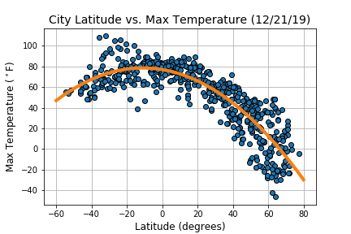

### Background

Create a Python script to visualize the weather of 500+ cities across the world of varying distance from the equator. To accomplish this, utilize a [simple Python library](https://pypi.python.org/pypi/citipy), the [OpenWeatherMap API](https://openweathermap.org/api), and a little common sense to create a representative model of weather across world cities.

### Plotting

The objective is to build a series of scatter plots to showcase the following relationships:

* Temperature (F) vs. Latitude

* Humidity (%) vs. Latitude

* Cloudiness (%) vs. Latitude

* Wind Speed (mph) vs. Latitude

