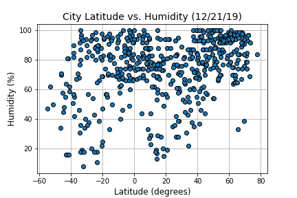
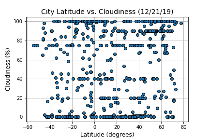

### Background

Create a Python script to visualize the weather of 500+ cities across the world of varying distance from the equator. To accomplish this, utilize a [simple Python library](https://pypi.python.org/pypi/citipy), the [OpenWeatherMap API](https://openweathermap.org/api), and a little common sense to create a representative model of weather across world cities.

### Weather API Data

Sample of the first few rows of data collected:

City|Cloudiness|Country|Date|Humidity|Lat|Lng|Max Temp|Wind Speed
--- | --- | --- | --- | --- | --- | --- | --- | --- | 
Ostrovnoy|44|RU|1576900077|98|68.05|39.51|8.26|13.35
Nikolskoye|90|RU|1576900077|93|59.7|30.79|35.6|6.71
Port Elizabeth|1|US|1576900077|68|39.31|-74.98|28.99|5.82
Jasper|1|US|1576900077|93|33.83|-87.28|50.0|4.99
Byron Bay|0|AU|1576900057|69|-28.65|153.62|93.2|21.92
Kapaa|90|US|1576900078|94|22.08|-159.32|78.8|26.4
Yellowknife|75|CA|1576899914|75|62.45|-114.38|-14.01|4.7
Lompoc|1|US|1576899918|66|34.64|-120.46|61.0|5.79
Sukumo|100|JP|1576900079|54|32.94|132.72|53.44|9.95

### Plotting

The objective is to build a series of scatter plots to showcase the following relationships:

* Temperature (F) vs. Latitude

* Humidity (%) vs. Latitude

* Cloudiness (%) vs. Latitude

* Wind Speed (mph) vs. Latitude

