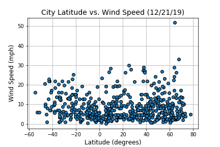

### Background

Create a Python script to visualize the weather of 500+ cities across the world of varying distance from the equator. To accomplish this, utilize a [simple Python library](https://pypi.python.org/pypi/citipy), the [OpenWeatherMap API](https://openweathermap.org/api), and a little common sense to create a representative model of weather across world cities.

### Weather API Data

Sample of the first few rows of data collected:

\\begin{tabular}{llrlrrrrrr}\n\\toprule\n{} &            City &  Cloudiness & Country &        Date &  Humidity &    Lat &     Lng &  Max Temp &  Wind Speed \\\\\n\\midrule\n0 &       Ostrovnoy &          44 &      RU &  1576900077 &        98 &  68.05 &   39.51 &      8.26 &       13.35 \\\\\n1 &      Nikolskoye &          90 &      RU &  1576900077 &        93 &  59.70 &   30.79 &     35.60 &        6.71 \\\\\n2 &  Port Elizabeth &           1 &      US &  1576900077 &        68 &  39.31 &  -74.98 &     28.99 &        5.82 \\\\\n3 &          Jasper &           1 &      US &  1576900077 &        93 &  33.83 &  -87.28 &     50.00 &        4.99 \\\\\n4 &       Byron Bay &           0 &      AU &  1576900057 &        69 & -28.65 &  153.62 &     93.20 &       21.92 \\\\\n\\bottomrule\n\\end{tabular}\n

### Plotting

The objective is to build a series of scatter plots to showcase the following relationships:

* Temperature (F) vs. Latitude

* Humidity (%) vs. Latitude

* Cloudiness (%) vs. Latitude

* Wind Speed (mph) vs. Latitude

